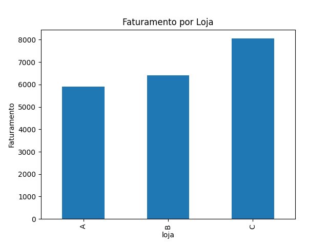
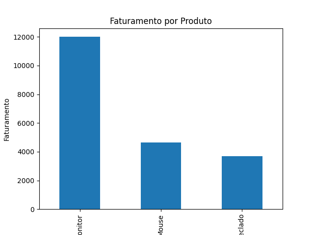

## 📊 Gráficos do Projeto

### Faturamento por Loja

Analisando o gráfico, a loja C apresentou o maior faturamento em comparação às demais

### Faturamento por Produto

O produto com melhor desempenho de faturamento foi o **Monitor**, representando **47,2% do faturamento total dos produtos**.
